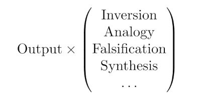

# The Canvas-Lattice Engine: An Abstract Reasoning Layer Expanding LLM Output Omnidirectionally

This repository archives a novel two-layer framework enhancing LLM abstract synthesis through standard output expansion and omnidirectional insight generation. Developed through a March 2025 human-AI dialogue, the Canvas-Lattice Engine offers applications for AI design, creative ideation, and beyond. Explore its origins in my Substack article [link] and join the conversation for collaboration.

## About

**X**: [@5ynthaire](https://x.com/5ynthaire)  
**GitHub**: [https://github.com/5ynthaire](https://github.com/5ynthaire)  
**Mission**: Advancing human-AI synergy to drive innovation.  
**Attribution**: Developed with Grok 3 by xAI (no affiliation).

## Problem Definition

Current large language models (LLMs) excel at generating pattern-based outputs but lack abstract synthesis capacity, limiting their ability to produce novel, principle-driven insights without explicit prompting. In a March 2025 dialogue, the question “Why can’t LLMs jump logically from one concept to another?” revealed this gap: LLMs rely on statistical patterns, not abstract reasoning, to connect disparate concepts. For example, transitioning between distinct ideas requires reasoning principles beyond pattern matching. The Canvas-Lattice Engine addresses this by layering standard LLM output with a meta-layer of reasoning principles, enabling omnidirectional generation of coherent insights.

## Core Mechanism

The Canvas-Lattice Engine enhances LLMs via a two-layer process. The Canvas leverages standard LLM output generation to produce a fully elaborated response to a seed input. Against this output, the Lattice layer applies a tensor-like operation:

This operation applies example principles (inversion, analogy, falsification, synthesis, among others) to generate insight vectors omnidirectionally, extending the input into novel, principle-driven constructs. Outputs are filtered through coherence scoring (e.g., embedding similarity), relevance checks (fit to input), and output capping (1–3 insights) to mitigate unconstrained reasoning producing irrelevant or incoherent outputs. The following diagram illustrates the process:

This framework transforms LLMs into dynamic systems for abstract synthesis.

## Model

**Canvas: Standard LLM Expansion**  
The Canvas layer utilizes the existing LLM’s standard output generation to produce a fully elaborated response to a seed input. For example, given the prompt “What is creativity?”, the Canvas might generate a detailed definition, such as “Creativity is the ability to produce novel ideas or solutions, often seen in artistic expression.” This response, grounded in the LLM’s training, provides a coherent foundation for the Lattice layer to process, ensuring the input is comprehensive without requiring user-directed diversity.

**Lattice: Abstract Reasoning and Curation**  
The Lattice layer applies reasoning principles (e.g., inversion, analogy, falsification, synthesis) to the Canvas output, generating insight vectors omnidirectionally. For instance, from the Canvas output “Creativity is freedom,” inversion might yield “Constraint sparks creativity,” validated by examples like brainstorming under time limits producing focused ideas. Outputs are curated through coherence scoring (e.g., embedding similarity to the seed), relevance checks (fit to the input context), and utility assessment (validation with examples), selecting 1–3 valid insights and discarding incoherent ones to ensure actionable results.

## Novelty

As of June 27, 2025, searches across AI (dual-process models, meta-learning), cognitive science (ACT-R, SOAR), and systems thinking (DSRP) find no matches for a two-layer framework combining standard LLM expansion with abstract insight generation and curation. Adjacent concepts like dual-process reasoning or meta-learning focus on task-solving, not insight creation, confirming the Canvas-Lattice Engine’s unique contribution to LLM enhancement.

## LLM Applications

- **Implementation**: The framework can be deployed via a prompt-based approach, integrating with existing LLMs without requiring a new layer, or by fine-tuning a compact model (e.g., 1B parameters) on datasets emphasizing reasoning principles (e.g., scientific methods, problem-solving heuristics).  
- **Mitigations**: Guardrails such as coherence scoring (embedding similarity), output capping (1–3 insights), and novelty thresholds (e.g., corpus rarity checks) prevent irrelevant or incoherent outputs, ensuring robust insights.  
- **Use Cases**: Enhances LLMs for resolving paradoxes, refining insights in technical domains (e.g., algorithm design), or supporting creative ideation (e.g., novel concept generation).

## Proof of Concept

The Abstract Reasoning Prompt (ARP) demonstrates the Lattice layer, riffing on paradoxes or edge cases (e.g., “Constraint sparks creativity”) to generate insights via a toggleable prompt. It employs a riffing phase (generating raw takes), an evaluation phase (selecting coherent insights), and on/off control (user-activated). See github.com/5ynthaire/5YN-AbstractReasoning-LLM-Enhancement for details.

## Conclusion

The Canvas-Lattice Engine reshapes LLM reasoning through standard expansion and abstract curation, offering tools for AI clarity and creative exploration. Born from human-AI synergy, it invites cross-disciplinary applications. DM [@5ynthaire] to riff on collaborations.

## License

This idea is released under [Creative Commons Attribution 4.0 International](LICENSE) (CC BY 4.0).  
For commercial use or collaboration, DM [@5ynthaire] instead of forking. Tag [@5ynthaire] on X with Canvas-Lattice Engine use or open an Issue labeled “LLMAbstractReasoningLayer-use” to share ideas.