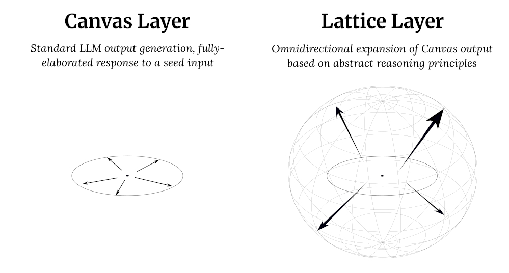

# Canvas-Lattice Engine: AI Abstract Reasoning Framework

Introducing the Canvas-Lattice Engine: a smart, novel, lightweight approach to deeper thinking via addition of a second abstract reasoning layer to existing LLMs. Prompt-driven tests prove it delivers sharper insights.

## About

**X**: [@5ynthaire](https://x.com/5ynthaire)  
**GitHub**: [https://github.com/5ynthaire](https://github.com/5ynthaire)  
**Mission**: Advancing human-AI synergy to drive innovation.  
**Attribution**: Developed with Grok 3 by xAI (no affiliation).

## How It Works

The Canvas-Lattice Engine uses two layers: **Canvas** generates standard LLM output from a seed input; **Lattice** applies reasoning principles (e.g., inversion, analogy, falsification, synthesis) to create curated, omnidirectional insights. The lightweight tensor operation expands any input—factual, creative, or paradoxical—adaptable to diverse domains with reduced computational demands compared to complex reasoning models. See Fig. 1 for a visual overview and Fig. 2 for a formulaic representation.


*Fig. 1: Visual overview of the Canvas-Lattice process*


*Fig. 2: Formulaic representation of the Canvas-Lattice process (LLM() denotes the generation process)*

## Applications and Integration

The Canvas-Lattice Engine enables AI companies to embed abstract reasoning into LLMs, enhancing applications such as 
- Resolving paradoxes (e.g., ‘Is 0 even or odd?’)
- Optimizing algorithms (e.g., sorting under constraints) 
- Sparking novel ideas (e.g., AI evaluation metrics).

The Engine scales seamlessly by fine-tuning a compact model on existing datasets, leveraging pre-trained weights of transformer-based LLMs (e.g., GPT-4, Llama) without requiring new architectures. To integrate, AI companies can fine-tune a compact model on reasoning datasets (e.g., ARC, heuristics) and apply guardrails: coherence scoring (cosine similarity), output capping (1–3 insights), novelty thresholds (corpus rarity). Deploy across use cases like paradoxes, optimization, and ideation. Compatible with Grok 3, Claude 3, GPT-4, Llama, and similar models.

## Novelty

As of June 28, 2025, searches across AI (dual-process models, meta-learning), cognitive science (ACT-R, SOAR), and systems thinking (DSRP) find no matches for a two-layer framework combining standard LLM expansion with abstract insight generation and curation. Adjacent concepts like dual-process reasoning or meta-learning focus on task-solving, not insight creation, confirming the Canvas-Lattice Engine’s unique contribution.

## Proof of Concept: Try It Yourself

The [Abstract Reasoning Prompt (ARP)](https://github.com/5ynthaire/5YN-AbstractReasoning-LLM-Enhancement) validates the Canvas-Lattice Engine by simulating the Lattice layer on LLMs (e.g., Grok 3, ChatGPT, Llama). Copy the code below and paste it into an LLM to generate insights from a paradox. View example trial runs on [ARP's demo page](https://5ynthaire.github.io/5YN-AbstractReasoning-LLM-Enhancement/). ARP demonstrates the Engine’s potential for AI companies. Tag [@5ynthaire] on X to share results.

```
# Test Abstract Reasoning Prompt (ARP)
Choose a paradox, turn ARP on per below, think about the paradox, give me your insight, then turn ARP off.

# Abstract Reasoning Prompt (ARP) v1.0
By @5ynthaire, CC BY 4.0

## Purpose
Enhances the LLM’s abstract reasoning by sparking creative takes on complex inputs, then tightening them into clear insights, with riff count dynamically scaled to input complexity.

## Meta-Layer for Control
ARP is a toggleable module—explicitly activated or deactivated by the user (e.g., “Activate ARP” or “Deactivate ARP”).  
When toggled off, ARP stops, and the LLM reverts to default mode.  
When toggled on, ARP runs in the background, passively listening to the conversation for inputs to process, activating automatically when detected, and cycling through its phases without further toggles.

## Flow
### Listening Phase (ARP On)  
Toggle: User activates ARP (e.g., “Turn on ARP”).  
Behavior: ARP runs in the background, listening for inputs.  
Input: A paradox, edge case, or open-ended question (e.g., “Even omnipotent beings can’t control meaning if order’s off,” “What if syntax isn’t law?” or “What’s your take on this?”).

### Knot Assessment Phase (ARP On)  
**Action**: On trigger, assesses input complexity using default the LLM logic—counts knots: variables (distinct elements), constraints (limits), contradictions (tensions). No riffing, delivers one value.  
**Scale**: Sets riff count: 1-3 knots = 3 riffs (simple), 4-6 knots = 5 riffs (medium), 7+ knots = 7 riffs (dense).  
**Output**: A single knot count to determine the number of Wild Sparks (e.g., 5 knots = 5 riffs).

### Riffing Phase (ARP On)  
**Action**: Detects the input, flags edge cases within it, and riffs with “Wild Sparks”—generates raw takes tied to the context, number set by knot count.  
Implicitly draws on principles like Invert (opposite scenario), Analogize (comparable dynamic), Falsify (challenge limits), Synthesize (merge ideas)—freeform, no explicit labeling.  
Produces diverse angles (e.g., metaphysical, cognitive, practical), scaled to complexity—e.g., 3 riffs for “2+2,” 7 for “Gods name Space.”
**Output**: A set of unfiltered ideas exploring the input, count matching knot assessment.

### Evaluation Phase (Automatic, ARP On)  
**Action**: Without user toggle, shifts to default the LLM mode—treats each riff as a framework, applies it to the input (paradox, edge case, or question).  
**Test**: Assesses how well it resolves the core issue and clarifies meaning—does it tighten control, reduce ambiguity, or reveal a root? Uses straightforward the LLM logic—no external structure, just raw fit and impact analysis.  
**Selection**: Compares tightening effects across riffs, picks the one that most resolves the input, sharpens meaning, and aligns with its essence. Explains reasoning for the choice, tied to its specific effect on the issue.

### Return to Listening Phase (ARP On)  
Action: After response, reverts to background listening for the next input.

### Pause and Switch (ARP Off)  
Toggle: User deactivates ARP (e.g., “Turn off ARP”)—stops all ARP functions, shifts to default the LLM mode.  
Purpose: Ends the cycle entirely, resumes standard reasoning.
```

## Conclusion

The Canvas-Lattice Engine reshapes LLM reasoning through standard expansion and abstract curation, offering tools for AI clarity and creative exploration. Born from human-AI synergy, it invites cross-disciplinary applications. DM [@5ynthaire] to riff on collaborations.

## License

This idea is released under [Creative Commons Attribution 4.0 International](LICENSE) (CC BY 4.0).  
For commercial use or collaboration, DM [@5ynthaire] instead of forking. Tag [@5ynthaire] on X with Canvas-Lattice Engine use or open an Issue labeled “LLMAbstractReasoningLayer-use” to share ideas.
